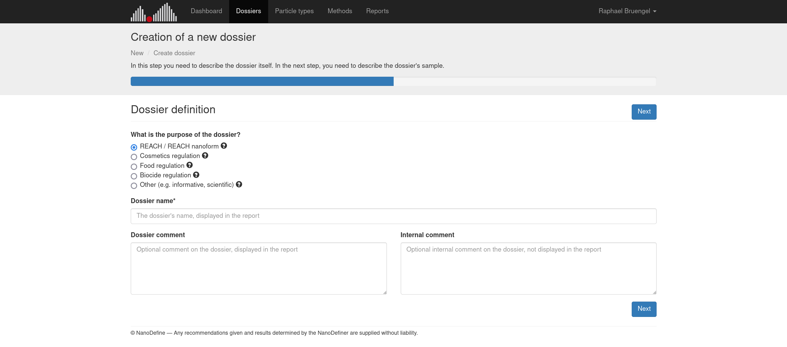
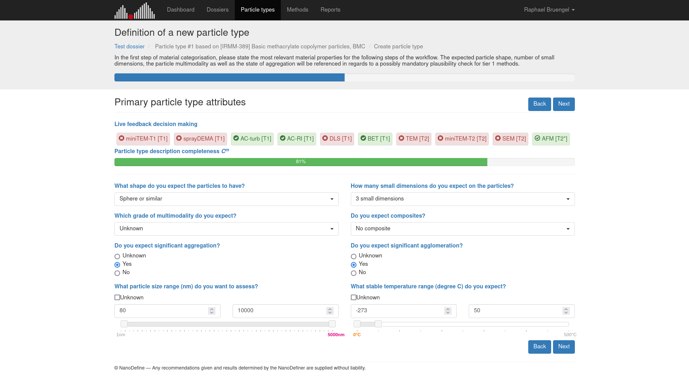
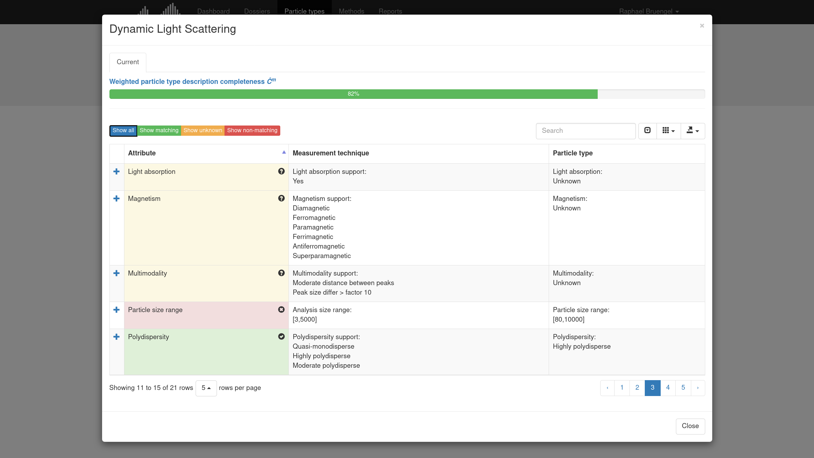
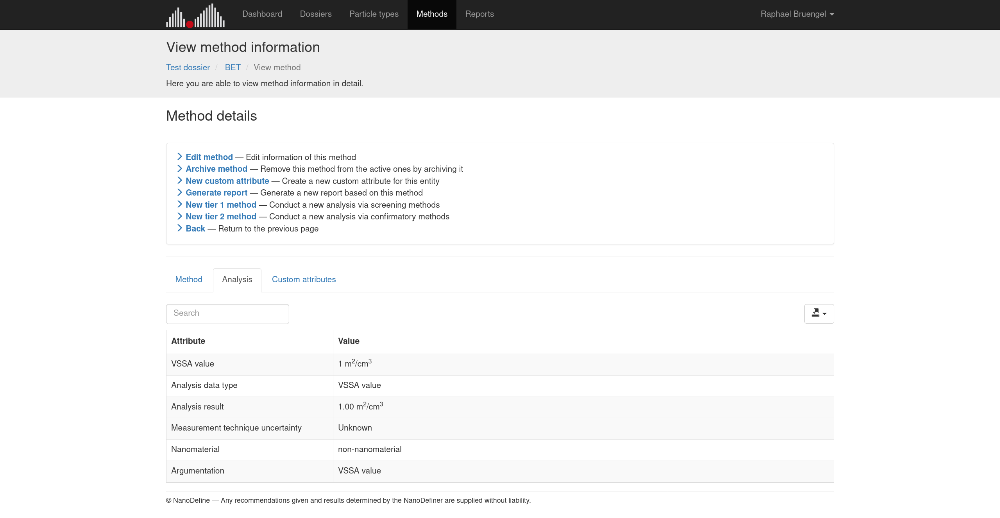
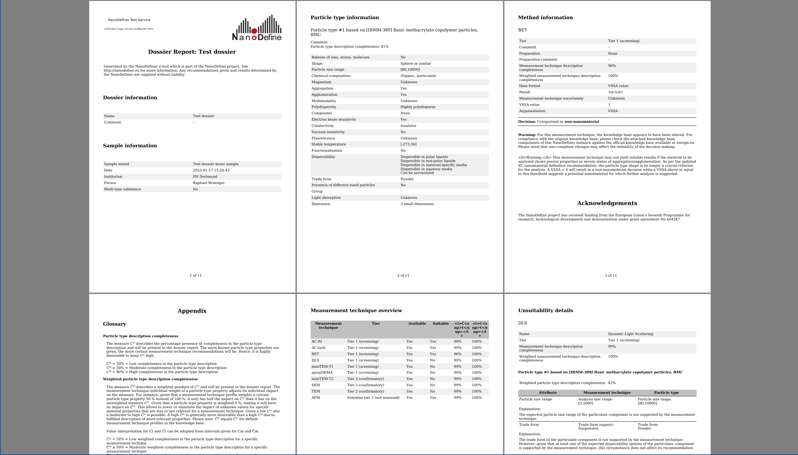

# NanoDefiner e-tool

[](https://zenodo.org/badge/latestdoi/120874735)

Welcome to the official repository for the NanoDefiner e-tool! :microscope: :computer: :notebook:

## What is the e-tool?

The e-tool is a ready-to-use implementation of the NanoDefiner Framework for decision support in categorisation of potential nanomaterials. It is one of the products delivered by the [NanoDefine](http://nanodefine.eu/) project. Originally adopting the NanoDefine approach for nanomaterial characterisation oriented towards the European Commission's [initial nanomaterial definition (2011/696/EU)](https://eur-lex.europa.eu/legal-content/EN/TXT/?uri=CELEX:32011H0696) from October 2011, it was recently updated and validated to further enable categorisation according to the [updated nanomaterial definition (022/C 229/01)](https://eur-lex.europa.eu/legal-content/EN/TXT/?uri=CELEX:32022H0614(01)), adopted in June 2022.


## What does the e-tool provide?

Basically, the e-tool provides support for detailed description of particulate components within a sample via regulatory relevant properties, selection of adequate measurement techniques based on sample properties, and measurement result-based material categorisation according to the European Commission's definition. Outcomes can be compiled to reports to serve as supplementary material for, e.g., [Registration, Evaluation, Authorisation and Restriction of Chemicals (REACH)](https://ec.europa.eu/environment/chemicals/reach/reach_en.htm). The whole process is implemented as a guided workflow, leading through the stages of

1. dossier creation and sample description,
3. measurement technique recommendation and selection,
4. processing and compilation of measurement results, and
5. material categorisation and report generation.

For more elaborations on each stage, check the following elaborations.


### Dossier creation and sample description

A dossier wraps information on its purpose (e.g., REACH), a sample with its particulate component(s), an arbitrary amount of analyses and results of selected measurement techniques, and a report summarising selected outcomes. Particulate component(s) of a samples are described using an implemented [material categorisation scheme](https://pubs.rsc.org/en/content/articlelanding/2019/na/c8na00175h) on regulatory relevent properties. This can either be done by hand, by customizing existing reference material templates, or using individually created ones. Side note: Experimental multi-type samples are possible!




### Measurement technique recommendation and selection

Based on described particulate component(s) of a sample, measurement techniques are recommended via rule-based decision making, based on expert knowledge stored within the e-tool's knowledge base. Following recommendations is optional, the e-tool provides explanations on why measurement techniques are recommended or not. According to the NanoDefine approach, measurement techniques are tiered into cost-efficient screening techniques (tier 1) and confirmatory techniques (tier 2). For selected measurement techniques analysis results can be imported or manually documented. Side note: The knowledge base is extensible, custom measurement techniques profiles can be added!






### Processing and compilation of measurement results

When it comes to categorisation, input of a method's X<sub>50</sub> (repectively the Volume-Specific Surface Area (VSSA) for Brunauer-Emmett-Teller) is possible. Alternatively, the e-tool supports direct import of [ParticleSizer](https://imagej.net/plugins/particlesizer) data of Electron Microscopy (EM) analyses, and [Single Particle Calculation tool](https://www.wur.nl/en/show/single-particle-calculation-tool.htm) data of Single-Particle Inductively Coupled Plasma Mass Spectrometry (spICP-MS) analyses for automated categorisation. Side note: Import of custom data formats is possible sticking to the e-tool's simple interface, or by transforming data into the ParticleSizer's simple cumulative size distribution format!




### Material categorisation and report generation

For each conducted method an individual categorisation is possible. E.g., in case a BET analysis yields a VSSA > 6 m<sup>2</sup>/cm<sup>3</sup> not allowing a direct "not a nanomaterial" categorisation, a consecutive Electron Microscopy (EM) may confirm it. All conducted methods with categorisation results or just a subset may be compiled into a comprehensive report that can serve as supplementary information for REACH or other purposes. It holds records on all available measurement techniques, recommendations with explanations, analysis results with categorisation decisions, and much more. Side note: Reports can be customized to institutional corporate identity and have imported analysis data attached to support evidence!




## Try-out and installation

To get your hands on the NanoDefiner e-tool without setting up an instance, just visit the official [NanoDefiner e-tool try-out service](https://labs.inf.fh-dortmund.de/NanoDefiner), hosted by the University of Applied Sciences and Arts Dortmund, Germany. Access is granted after a registration request has been filed.


Installation resources can be obtained from the [download page](https://labs.inf.fh-dortmund.de/NanoDefiner/static/download.html). A service instance can be set up using the source code base, however, using the [Docker image](https://hub.docker.com/r/nanodefiner/nanodefiner) is recommended.

In case you experience any trouble setting up the NanoDefiner e-tool, please feel free to get in touch with the devs and file an issue in this repository!


## Cite as

When referring to the e-tool, please use the following references (Harvard Style):

- Brüngel, R., Rückert, J., Wohlleben, W., Babick, F., Ghanem, A., Gaillard, C., Mech, A., Rauscher, H., Hodoroaba, V.-D., Weigel, S., & Friedrich, C. M. (2019). NanoDefiner e-Tool: An Implemented Decision Support Framework for Nanomaterial Identification. Materials, 12(19), 3247. https://doi.org/10.3390/ma12193247

```
@article{bruengel2019nanodefiner_etool,
	author = {Brüngel, Raphael and Rückert, Johannes and Wohlleben, Wendel and Babick, Frank and Ghanem, Antoine and Gaillard, Claire and Mech, Agnieszka and Rauscher, Hubert and Hodoroaba, Vasile-Dan and Weigel, Stefan and Friedrich, Christoph M.},
	title = {{NanoDefiner e-Tool: An Implemented Decision Support Framework for Nanomaterial Identification}},
	year = {2019},
	journal = {Materials},
	issn = {1996-1944},
	volume = {12},
	number = {19},
	pages = {3247},
	url = {https://www.mdpi.com/1996-1944/12/19/3247},
	doi = {10.3390/ma12193247}
}
```

- Brüngel, R., Rückert, J., Müller, P., Babick, F., Friedrich, C. M., Ghanem, A., Hodoroaba, V.-D., Mech, A., Weigel, S., Wohlleben, W., & Rauscher, H. (2023). NanoDefiner Framework and e-Tool Revisited According to the European Commission's Nanomaterial Definition 2022/C 229/01. Nanomaterials. Submitted, under review.

```
@article{bruengel2023nanodefiner_revisit,
	author = {Brüngel, Raphael and Rückert, Johannes and Müller, Philipp and Babick, Frank and Friedrich, Christoph M. and Ghanem, Antoine and Hodoroaba, Vasile-Dan and Mech, Agnieszka and Weigel, Stefan and Wohlleben, Wendel and Rauscher, Hubert},
	title = {{NanoDefiner Framework and e-Tool Revisited According to the European Commission's Nanomaterial Definition 2022/C 229/01}},
	year = {2023},
	journal = {Nanomaterials},
	issn = {2079-4991},
	volume = {},
	number = {},
	pages = {},
	url = {},
	doi = {}
	note = {Submitted, under review}
}
```


## Related work

The e-tool is related to the following works (Harvard style, sorted by most recent publication date):

- European Commission (2022). Commission Recommendation of 10 June 2022 on the definition of nanomaterial (2022/C 229/01). Official Journal of the European Union, C 229, 1-5. https://eur-lex.europa.eu/legal-content/EN/TXT/?uri=CELEX:32022H0614(01)

- Mech, A., Wohlleben, W., Ghanem, A., Hodoroaba, V.‐D., Weigel, S., Babick, F., Brüngel, R., Friedrich, C. M., Rasmussen, K., Rauscher, H. (2020). Nano or Not Nano? A Structured Approach for Identifying Nanomaterials According to the European Commission's Definition. Small, 2002228. https://doi.org/10.1002/smll.202002228

- Mech, A., Rauscher, H., Babick, F., Hodoroaba, V.-D., Ghanem, A., Wohlleben, W., Marvin, H., Weigel, S., Brüngel, R., Friedrich, C., Rasmussen, K., Loeschner, K., Gilliland, D. (2020). The NanoDefine Methods Manual. EUR 29876 EN, Publications Office of the European Union, Luxembourg, 2020, ISBN 978-92-76-12335-4, https://doi.org/10.2760/79490, JRC117501

- Mech, A., Rauscher, H., Babick, F., Hodoroaba, V.-D., Ghanem, A., Wohlleben, W., Marvin, H., Weigel, S., Brüngel, R., Friedrich, C. M. (2020). The NanoDefine Methods Manual. Part 1: The NanoDefiner Framework and Tools. EUR 29876 EN, Publications Office of the European Union, Luxembourg, 2020, ISBN 978-92-76-11950-0, https://doi.org/10.2760/55181, JRC117501

- Mech, A., Rauscher, H., Rasmussen, K., Babick, F., Hodoroaba, V.-D., Ghanem, A., Wohlleben, W., Marvin, H., Brüngel, R., Friedrich, C. M. (2020). The NanoDefine Methods Manual. Part 2: Evaluation of methods. EUR 29876 EN, Publications Office of the European Union, Luxembourg, 2020, ISBN 978-92-76-11953-1, https://doi.org/10.2760/071877, JRC117501

- Mech, A., Rauscher, H., Rasmussen, K., Babick, F., Hodoroaba, V.-D., Ghanem, A., Wohlleben, W., Marvin, H., Brüngel, R., Friedrich, C. M., Löschner, K., Gilliland, D. (2020). The NanoDefine Methods Manual. Part 3: Standard Operating Procedures (SOPs). EUR 29876 EN, Publications Office of the European Union, Luxembourg, 2020, ISBN 978-92-76-11955-5, https://doi.org/10.2760/02910, JRC117501

- Brüngel, R., Rückert, J., Wohlleben, W., Babick, F., Ghanem, A., Gaillard, C., Mech, A., Rauscher, H., Hodoroaba, V.-D., Weigel, S., Friedrich, C. M. (2019). NanoDefiner e-Tool: An Implemented Decision Support Framework for Nanomaterial Identification. Materials, 12(19), 3247. https://doi.org/10.3390/ma12193247

- Rauscher, H., Mech, A., Gibson, N., Gilliland, D., Held, A., Kestens V., Koeber, R., Linsinger, T. P. J., Stefaniak, E. A. (2019). Identification of nanomaterials through measurements. EUR 29942 EN, Publications Office of the European Union, Luxembourg, 2019, ISBN 978-92-76-10371-4, https://doi.org/10.2760/053982, JRC118158

- Rauscher, H., Roebben, Mech, A., Gibson, N., Kestens, V., Linsinger, T. P. J., Riego Sintes, J. An overview of concepts and terms used in the European Commission's definition of nanomaterial, EUR 29647 EN, Publications Office of the European Union, Luxembourg, 2019, ISBN 978-92-79-99660-3, https://doi.org/10.2760/459136, Publications Office of the European Union

- Gaillard, C., Mech, A., Wohlleben, W., Babick, F., Hodoroaba, V.-D., Ghanem, A., Weigel, S., & Rauscher, H. (2019). A technique-driven materials categorisation scheme to support regulatory identification of nanomaterials. Nanoscale Advances, 1(2), 781–791. https://doi.org/10.1039/c8na00175h

- Uusimaeki, T., Wagner, T., Lipinski, H.-G., & Kaegi, R. (2019). AutoEM: a software for automated acquisition and analysis of nanoparticles. Journal of Nanoparticle Research, 21(6). https://doi.org/10.1007/s11051-019-4555-9

- Brüngel, R., Rückert, J., Wohlleben, W., Babick, F., Ghanem, A., Gaillard, C., Mech, A., Rauscher, H., Weigel, S., Friedrich, C. M. (2017). The NanoDefiner e-tool — A decision support framework for recommendation of suitable measurement techniques for the assessment of potential nanomaterials. 2017 IEEE 12th Nanotechnology Materials and Devices Conference (NMDC). https://doi.org/10.1109/nmdc.2017.8350509

- Wohlleben, W., Mielke, J., Bianchin, A., Ghanem, A., Freiberger, H., Rauscher, H., Gemeinert, M., & Hodoroaba, V.-D. (2017). Reliable nanomaterial classification of powders using the volume-specific surface area method. Journal of Nanoparticle Research, 19(2). https://doi.org/10.1007/s11051-017-3741-x

- Babick, F., Mielke, J., Wohlleben, W., Weigel, S., & Hodoroaba, V.-D. (2016). How reliably can a material be classified as a nanomaterial? Available particle-sizing techniques at work. Journal of Nanoparticle Research, 18(6). https://doi.org/10.1007/s11051-016-3461-7

- Peters, R., Herrera-Rivera, Z., Undas, A., van der Lee, M., Marvin, H., Bouwmeester, H., & Weigel, S. (2015). Single particle ICP-MS combined with a data evaluation tool as a routine technique for the analysis of nanoparticles in complex matrices. Journal of Analytical Atomic Spectrometry, 30(6), 1274–1285. https://doi.org/10.1039/c4ja00357h

- European Commission (2011). Commission Recommendation of 18 October 2011 on the definition of nanomaterial (2011/696/EU). Official Journal of the European Union, L 275, 38–40. https://eur-lex.europa.eu/legal-content/EN/TXT/?uri=CELEX:32011H0696


## Acknowledgment

The NanoDefine project has received funding from the European Union’s Seventh Programme for research, technological development and demonstration under grant agreement No 604347-2.
